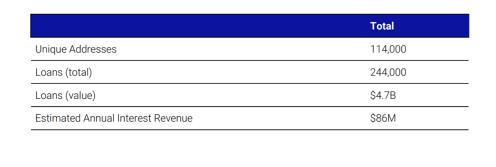

# SALT LENDING

## Background about SALT

**SALT** stands for **Secured Automated & Lending Technology**

SALT was founded in 2016 by a group of Bitcoin enthusiasts who aimed to prove that people didn’t need to compromise their lifestyle or forego their needs in order to pursue a long term outlook on cryptocurrency. Salt introduced asset backed lending to the cryptocurrency marketplace, providing a new level of versatility to digital asset holders.

**Shawn Owen**, a graduate from Southern Utah University was the co-founder & CEO for SALT till 2018.

Salt Lending Holdings, Inc is a Private company headquartered in Denver, Colorado. Salt Lending Holdings, Inc has received a total of $1.5M in funding. Currently, SALT Lending has expanded to 46 U.S. states and also operates in the United Kingdom, New Zealand, Hong Kong, Vietnam and more.

## Idea Behind SALT
SALT is a membership-based financing ecosystem. 

SALT revolves around the company’s trademarked Blockchain-Backed Loans. Blockchain-Backed Loans are simply loans in which you hand over a blockchain asset, like Bitcoin, as collateral in exchange for traditional currencies. Unlike traditional auto or home loans, you can use these loans for any personal or business expense.

SALT is automated, cost-effective, transparent and cryptographically secure. This allows their Members to plan tax events, and maintain their long position in a chosen blockchain asset.

SALT's globally available asset-backed financing solution empowers liquidity providers to manage the risk of lending to a rapidly expanding, underserved and immediately addressable borrower base.

## Business Activities

**Problem in existing Financial Lending Industry**
* **`Less Flexibility in Lending`**' Because of financial regulations in place, those with lower credit scores have a harder time obtaining a loan
* **`Slower Application Process`** Because there are so many rules, regulations, and face-to-face meetings to fill out paperwork and submit documents, the application time is slower and more tedious than with digital lenders. Digital lenders have a more streamlined approach but still follow the same process to identify the most qualified borrowers with the least amount of hassle.
* **`Inconvenience`** Banks are typically only open during standard business hours, which makes it hard for many working people, especially on time sensitive banking matters.
* **`Processing Costs & Fees`** Processing Cost / Loan Application Fees is a fee charged to a potential borrower for processing an application for a loan and are intended to pay for all the costs of the process of loan approval.

**Intended Market**

Crypto backed lending is not a product, company or any organization. It’s  innovative technology, a technology that has  disrupted the traditional financial lending market
Crypto backed lending sector overall is approx. $5B in value
As per the report from [BlockCrypto](https://www.theblockcrypto.com/linked/36152/crypto-lending-sector-hits-nearly-5b-in-value-but-lenders-earn-less-than-2-interest-report), below are the details about crypto lending sector overall:
  

**SALT Lending Process**

Users buy membership to the Salt Lending platform by purchasing Salt, which is the platform's cryptocurrency. 

Salt is built on an ERC-20 smart contract. ERC-20 is a standard that any Ethereum token contracts must implement, in order to facilitate the exchange of tokens

When someone becomes a member, they can borrow money from an extensive network of lenders. Borrowers put up bitcoin, ether, ripple and other blockchain assets as collateral. 
This is because Salt Lending, instead of determining the eligibility of a borrower by focusing on their credit score, grants eligibility on the value of the borrower's blockchain assets. 
Because of this, approval is fast. Salt keeps collateral assets safe in a "fully-audited, ultra-secure architecture during the life of the loan so members can borrow with confidence," according to their [website](https://saltlending.com/)

Borrowers are charged interest on the loan, as they would be on any other loan. However, unlike other loans, when a borrower pays it off, they receive their blockchain-backed assets back. 

**Technology that set apart SALT from others**

* **`Security`** SALT is  *CCSS (CryptoCurrency Security Standards)*-certified, meaning  maintenance of high-security standards when it comes to managing customer assets. Once a customer transfers assets to SALT platform, they are held in cold storage and are protected by a multi-signature process, meaning no single individual can move funds. Unlike other crypto-backed lenders, SALT don’t rehypothecate customer assets or commingle them with assets owned by other customers.

* **`Customer Support`** Loans are funded in as little as 24 hours and also help the customers around the world with any questions they may have, we offer phone support during normal business hours and 24/7 online support. Given it’s not easy these days to reach a real human even in the traditional banking space without first having to go through numerous automated options,  customer support offerings make it easy for borrowers to communicate with us directly as the need arises. 

* **`Customizable Loan Options`** When applying for a loan with SALT, customers can choose their loan amount, loan type, duration and starting Loan-to-Value (LTV) ratio ranging from 30% to 70%.  
           
* **`LTV monitoring system`** Customers get access to LTV monitoring system that tracks the prices of assets 24 hours a day, 365 days per year. If there’s a meaningful price drop, our real-time alert system notifies customers immediately via phone calls, texts and emails, so they can effectively manage their loan.

A common misconception is that you can’t collateralize crypto assets because they are volatile in nature. While this misconception is understandable, SALT exists because they have solved that very issue. 

The technology that enables to track the prices of assets all day every day, along with the health of our customers’ loans and rely on this real-time monitoring system to inform when a customer’s collateral is declining in value, causing their Loan-to-Value ratio to rise. 

By custodying the customers’ assets for the duration of their loan, SALT retains the ability to liquidate a portion of their collateral if the customer does not take action to restore the health of their loan during a market downturn. This enables to prevent losses of principal for the lender.

So, while managing such volatility is not common in traditional asset-backed lending, SALT has  found a way to manage crypto assets as collateral, which has enabled it to bring this alternative asset class to the traditional finance space. 

