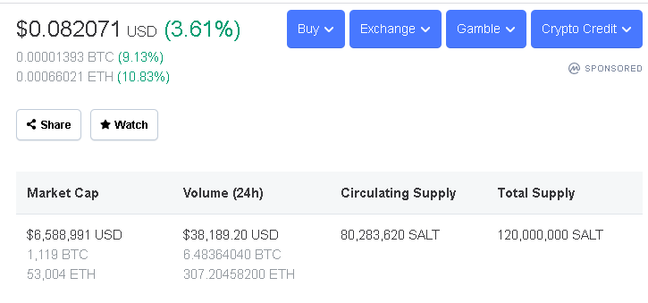
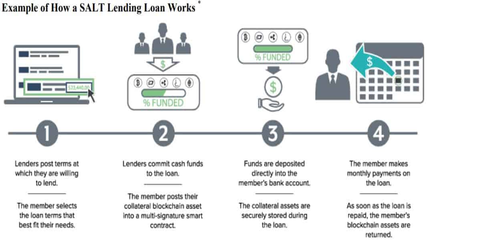

# SALT LENDING

## ABOUT SALT

**SALT** stands for **Secured Automated & Lending Technology**

SALT was founded in 2016 by a group of Bitcoin enthusiasts who aimed to prove that people didn’t need to compromise their lifestyle or forego their needs in order to pursue a long term outlook on cryptocurrency. Salt introduced asset backed lending to the cryptocurrency marketplace, providing a new level of versatility to digital asset holders.

**Shawn Owen**, a graduate from Southern Utah University was the co-founder & CEO for SALT till 2018.

Salt Lending Holdings, Inc is a Private company headquartered in Denver, Colorado. Salt Lending Holdings, Inc has received a total of $1.5M in funding. Currently, SALT Lending has expanded to 46 U.S. states and also operates in the United Kingdom, New Zealand, Hong Kong, Vietnam and more.

## Idea Behind SALT
SALT is a membership-based financing ecosystem. 

SALT revolves around the company’s trademarked Blockchain-Backed Loans. Blockchain-Backed Loans are simply loans in which you hand over a blockchain asset, like Bitcoin, as collateral in exchange for traditional currencies. Unlike traditional auto or home loans, you can use these loans for any personal or business expense.

SALT is automated, cost-effective, transparent and cryptographically secure. This allows their Members to plan tax events, and maintain their long position in a chosen blockchain asset.

SALT's globally available asset-backed financing solution empowers liquidity providers to manage the risk of lending to a rapidly expanding, underserved and immediately addressable borrower base.

## BUSINESS ACTIVITIES

### Problem in existing Financial Lending Industry
* **`Less Flexibility in Lending`** Because of financial regulations in place, those with lower credit scores have a harder time obtaining a loan
* **`Slower Application Process`** Because there are so many rules, regulations, and face-to-face meetings to fill out paperwork and submit documents, the application time is slower and more tedious than with digital lenders. Digital lenders have a more streamlined approach but still follow the same process to identify the most qualified borrowers with the least amount of hassle.
* **`Inconvenience`** Banks are typically only open during standard business hours, which makes it hard for many working people, especially on time sensitive banking matters.
* **`Processing Costs & Fees`** Processing Cost / Loan Application Fees is a fee charged to a potential borrower for processing an application for a loan and are intended to pay for all the costs of the process of loan approval.

### Intended Market

Crypto backed lending is not a product, company or any organization. It’s  innovative technology, a technology that has  disrupted the traditional financial lending market

Crypto backed lending sector overall is approx. $5B in value

SALT Lending market cap is $6.6M in value

As per the report from "coinmarketcap", below are the details about SALT Lending market:

  

### SALT Lending Process

#### Loan Process

Users buy membership to the Salt Lending platform by purchasing Salt, which is the platform's cryptocurrency. 

Salt is built on an ERC-20 smart contract. ERC-20 is a standard that any Ethereum token contracts must implement, in order to facilitate the exchange of tokens

When someone becomes a member, they can borrow money from an extensive network of lenders. Borrowers put up bitcoin, ether, ripple and other blockchain assets as collateral. 
This is because Salt Lending, instead of determining the eligibility of a borrower by focusing on their credit score, grants eligibility on the value of the borrower's blockchain assets. 
Because of this, approval is fast. Salt keeps collateral assets safe in a "fully-audited, ultra-secure architecture during the life of the loan so members can borrow with confidence," according to their [website](https://saltlending.com/)

Borrowers are charged interest on the loan, as they would be on any other loan. However, unlike other loans, when a borrower pays it off, they receive their blockchain-backed assets back. 

#### SALT Oracle

The SALT Oracle creates the smart contracts for each loan and triggers the events of the loan. To lower the risk of default, the Oracle also records loan payments and monitors the changing value of the crypto collateral.

Every loan starts with a loan-to-value ratio that’s calculated from the terms of the loan. This ratio is effectively the amount of the loan divided by the amount of collateral. For example, a $100,000 loan secured by $125,000 worth of Ethereum would have an original loan-to-value ratio of:

$100,000 / $125,000 = 80.0%

As borrower pay off the loan, this ratio decreases because the amount of the outstanding loan decreases. However, if the value of your collateral decreases due to a decline in the market price, this ratio will increase.

If the ratio ever increases beyond the initial loan-to-value ratio, you’ll be required to either:

* provide more collateral, or pay-off an additional amount of the loan until the ratio returns to the original level.

* The Oracle autonomously tracks the loan-to-value ratios and notifies the borrowers when it becomes too high. The amount of time a borrower has to correct the ratio differs based on the velocity of the price decline

### Technology that set apart SALT from others

* **`Security`** SALT is  *CCSS (CryptoCurrency Security Standards)*-certified, meaning  maintenance of high-security standards when it comes to managing customer assets. Once a customer transfers assets to SALT platform, they are held in cold storage and are protected by a multi-signature process, meaning no single individual can move funds. Unlike other crypto-backed lenders, SALT don’t rehypothecate customer assets or commingle them with assets owned by other customers.

* **`Customer Support`** Loans are funded in as little as 24 hours and also help the customers around the world with any questions they may have, we offer phone support during normal business hours and 24/7 online support. Given it’s not easy these days to reach a real human even in the traditional banking space without first having to go through numerous automated options,  customer support offerings make it easy for borrowers to communicate with us directly as the need arises. 

* **`Customizable Loan Options`** When applying for a loan with SALT, customers can choose their loan amount, loan type, duration and starting Loan-to-Value (LTV) ratio ranging from 30% to 70%.  
           
* **`LTV monitoring system`** Customers get access to LTV monitoring system that tracks the prices of assets 24 hours a day, 365 days per year. If there’s a meaningful price drop, our real-time alert system notifies customers immediately via phone calls, texts and emails, so they can effectively manage their loan.

A common misconception is that you can’t collateralize crypto assets because they are volatile in nature. While this misconception is understandable, SALT exists because they have solved that very issue. 

The technology that enables to track the prices of assets all day every day, along with the health of our customers’ loans and rely on this real-time monitoring system to inform when a customer’s collateral is declining in value, causing their Loan-to-Value ratio to rise. 

By custodying the customers’ assets for the duration of their loan, SALT retains the ability to liquidate a portion of their collateral if the customer does not take action to restore the health of their loan during a market downturn. This enables to prevent losses of principal for the lender.

So, while managing such volatility is not common in traditional asset-backed lending, SALT has  found a way to manage crypto assets as collateral, which has enabled it to bring this alternative asset class to the traditional finance space. 

## LANDSCAPE

### Crypto-based Lending
  > Loan powered by modern technologies via Cryptocurrency-backed loan 
* Ability to leverage your crypto holdings to borrow fiat currencies
* You may find yourself in a situation where you need liquidity, but don't want to release your assets. Instead of selling your crypto holdings at a potential loss, you can use your cryptocurrency as collateral to take out a crypto-backed loan
* This allows you to balance your need for hard currency, whilst not losing out on your long term investment
* Crypto-backed loans to do anything from paying off credit card debt to buying a home. 
* Businesses turn to SALT to help them with payroll financing and business expansion. There are many advantages to borrowing instead of selling, including tax benefits

### Evolution of Lending

### Trends & Innovation
  > In 2010, LendingTree.com survey found that 21% of prospective home loan consumers shopped online. 
  
  > In 2015, BBVA survey states that 45% increase in consumer loans through mobile phones.

The rise of Fintech made much more changes in the lending system. Now, it also gives rise to many peer to peer lending sites. Over the past few years, we've come to realize that lending is no longer constrained to the doors and floors of a bank. The people are completely moving to the automated world where everything available online inside their smart phones

A new innovation in the finance industry, blockchain assets are ideal collateral because
  * They exist in a ***distributed***
  * ***Peer-to-Peer*** ledger
  * ***Efficient*** transfer, storage and liquidation
  * ***Transparent*** and publicly viewable
  * Lowers both ***costs and instances of fraud***

  Additionally, there can be ***tax benefits*** to borrowing crypto. Unlike selling your crypto, a crypto or bitcoin backed loan does not trigger a capital gains tax event, saving you the headache when doing your crypto taxes.

### Use Crypto Load For

Crypto backed loans are one of the most cost-effective and efficient ways to manage your cryptocurrencies when you need access to USD. 
  * **`Buying a home`** – traditional lenders will not let you pay for a home with crypto
  * **`Diversifying investments`** – lower the risk of your portfolio by diversifying
  * **`Paying off travel expenses`** – use your crypto to go on vacation
  * **`Paying off high-cost debt`** – refinancing debt from credit cards or student loans
  * **`Funding a business`** – access credit for your business using crypto

### Major Companies Involved

:white_medium_square: [SALT Lending](https://saltlending.com/) - The platform with the most market experience
 &nbsp;&nbsp;&nbsp;&nbsp;&nbsp;&nbsp;&nbsp;&nbsp;`Great platform for crypto borrowers in search of a bitcoin loan no collateral`

:white_medium_square: [Bankera Loans](https://bankera.com/) – Best for the safety of your digital assets
 &nbsp;&nbsp;&nbsp;&nbsp;&nbsp;&nbsp;&nbsp;&nbsp;`Credit specialist that prides itself on the transparency of their rates as well as the safety of their cold storage systems`

:white_medium_square: [BlockFi](https://blockfi.com/) – The only crypto account to offer compound interest and trading
 &nbsp;&nbsp;&nbsp;&nbsp;&nbsp;&nbsp;&nbsp;&nbsp;`Launched a crypto deposit account that provides compound interest`

:white_medium_square: [Celsius Network](https://celsius.network/) - Fee-free crypto lending
 &nbsp;&nbsp;&nbsp;&nbsp;&nbsp;&nbsp;&nbsp;&nbsp;`The platform has no withdrawal fees, early termination fees or default fees`

:white_medium_square: [Nexo](https://nexo.io/) - Most advanced platform for crypto loans
 &nbsp;&nbsp;&nbsp;&nbsp;&nbsp;&nbsp;&nbsp;&nbsp;`The lender markets it as ‘the world’s first instant crypto credit line`

## RESULT

### Key Factor

1. **No credit Checks** – Crypto loans typically require digital collateral. This means that all manner of borrowers, even bad creditors who cannot access loans from financial institutions can be able to obtain loans. Bitcoin lenders assess your creditworthiness by looking into other factors other than your credit score
2. **Fast** – The loan approval speed is usually higher than in traditional loans. Although this may vary between lenders, it is mostly a faster alternative than going through a traditional lender.
3. **Opportunity to get passive income** – Bitcoin hodlers can earn extra income by lending their crypto to borrowers as they wait for the markets to be favorable
4. **Better rates** – Borrowers can find favorable loan terms such as lower interest rates in comparison to traditional loans

In addition to that, SALT offers

  * No monthly minimum payments 
  
  * Set pre-established loan terms
  
  * Minimizes taxes as conversion to U.S Dollar is not required

### Performance relative to competitor

With its top security practices and high-quality customer service, SALT Lending is positioned as a forward-thinking platform that can effectively preserve the value of borrowers’ cryptocurrencies.
    
   &nbsp;&nbsp;&nbsp;:heavy_check_mark: Starting from $5,000*

   &nbsp;&nbsp;&nbsp;:heavy_check_mark: Interest rates from 5.95% *

   &nbsp;&nbsp;&nbsp;:heavy_check_mark: Terms from 3 to 12 months

   &nbsp;&nbsp;&nbsp;:heavy_check_mark: Starting LTV from 30% - 70%
   
   &nbsp;&nbsp;&nbsp;:heavy_check_mark: $0 origination or prepayment fees

## RECOMMENDATION

Crypto market is up and running throughout the day, so while arbitragers try to make a profit out of it. The lenders/borrowers might suffer a set back if the money repaid/borrowed has dipped throughout the day. 

Many investors might see a possibility of seeing an assets’ value depreciated to a point where the debtor is better off defaulting than repaying the loan.

For example, after the announcement of the *Facebook* digital coin *Libra*, it climbed almost 55% in a week to reach an 18-month price high. A few weeks later, it dropped over 10% after calls for Libra scrutiny from politicians and regulators.

Due to volatility nature of cryptocurrency, the loan should be given only for a short period of time (approx 12 months). Also, it should be powered by a credit agency in order to have instant crypto credit line. 
(eg – Credissimo – a leading European FinTech with a proven track record)

**Possible Innovation**

In a spin-off of this application of blockchain, some lenders are hoping to leverage blockchain technology, and smart contract technology directly in loans. 

This would mean that the terms of the loan would exist within the ledger itself, and this would facilitate automatic functions in the loan, like payment and collection. 

This has huge implications for peer-to-peer, unsecured lending, which could be made more efficient, and much more secure and reliable.

**Closing Remarks**

As more and more crypto-based lending solutions are about to burst into the market, making the right decision will become the central issue for the average user. 

To make the best decision possible, be sure to think about the LTV ratio, interest rates, repayment schedule, as well as customer support services before even signing up for the services.

SALT lendings, while a relatively new platform on the market is a genuinely solid alternative to any established players in the industry. 

### RESOURCES

* https://saltlending.com/ (Information about SALT)
* https://list.wiki/SALT_(SALT) (Wikipedia page about SALT)
* https://www.investopedia.com/tech/salt-secured-automated-lending-technology-blockchain/ (SALT Lending Process)
* https://coincentral.com/salt-lending-beginner-guide/ (SALT Lending Process with real example)
* https://withcadence.io/blog/crypto-chat-qa-with-dustin-vp-of-salt-lending/utm_source=beamer&utm_medium=sidebar&utm_campaign=Crypto-Chat-QA-with-Dustin-Hull-Co-President-CFO-SALT-Lending&utm_content=ctalink (A discussion with Dustin Hall, VP of SALT Lending)
* https://cointelegraph.com/news/crypto-loans-see-solid-growth-platforms-attract-community-interest (Details about the competitors)
* https://learnbonds.com/loans/bitcoin-loans (Details about Bitcoin Loans)
* https://habiletechnologies.com/blog/loan-origination-trends/ (Trends about Traditional Financing & Digital Financing)

### POWERPOINT SLIDES

* https://docs.google.com/presentation/d/18Lm1qq2UZo0Ga20pZZ0ufAlG2UKNJcs3/edit#slide=id.p1

