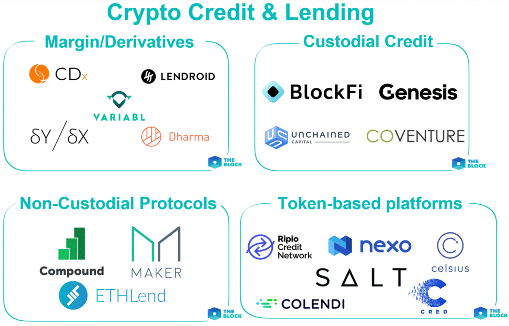

## LANDSCAPE

### Crypto-based Lending
  > Loan powered by modern technologies via Cryptocurrency-backed loan 
* Ability to leverage your crypto holdings to borrow fiat currencies
* You may find yourself in a situation where you need liquidity, but don't want to release your assets. Instead of selling your crypto holdings at a potential loss, you can use your cryptocurrency as collateral to take out a crypto-backed loan
* This allows you to balance your need for hard currency, whilst not losing out on your long term investment
* Crypto-backed loans to do anything from paying off credit card debt to buying a home. 
* Businesses turn to SALT to help them with payroll financing and business expansion. There are many advantages to borrowing instead of selling, including tax benefits

### Evolution of Lending

### Trends & Innovation
  > In 2010, LendingTree.com survey found that 21% of prospective home loan consumers shopped online. 
  
  > In 2015, BBVA survey states that 45% increase in consumer loans through mobile phones.

The rise of Fintech made much more changes in the lending system. Now, it also gives rise to many peer to peer lending sites. Over the past few years, we've come to realize that lending is no longer constrained to the doors and floors of a bank. The people are completely moving to the automated world where everything available online inside their smart phones

A new innovation in the finance industry, blockchain assets are ideal collateral because
  * They exist in a ***distributed***
  * ***Peer-to-Peer*** ledger
  * ***Efficient*** transfer, storage and liquidation
  * ***Transparent*** and publicly viewable
  * Lowers both ***costs and instances of fraud***

  Additionally, there can be ***tax benefits*** to borrowing crypto. Unlike selling your crypto, a crypto or bitcoin backed loan does not trigger a capital gains tax event, saving you the headache when doing your crypto taxes.

### Use Crypto Load For

Crypto backed loans are one of the most cost-effective and efficient ways to manage your cryptocurrencies when you need access to USD. 
  * `Buying a home` – traditional lenders will not let you pay for a home with crypto
  * `Diversifying investments` – lower the risk of your portfolio by diversifying
  * `Paying off travel expenses` – use your crypto to go on vacation
  * `Paying off high-cost debt` – refinancing debt from credit cards or student loans
  * `Funding a business` – access credit for your business using crypto

### Major Companies Involved

:white_medium_square: [SALT Lending](https://saltlending.com/) - The platform with the most market experience

&nbsp;&nbsp;&nbsp;&nbsp;&nbsp;&nbsp;&nbsp;&nbsp;`Great platform for crypto borrowers in search of a bitcoin loan no collateral`

:white_medium_square: [Bankera Loans](https://bankera.com/) – Best for the safety of your digital assets

&nbsp;&nbsp;&nbsp;&nbsp;&nbsp;&nbsp;&nbsp;&nbsp;`Credit specialist that prides itself on the transparency of their rates as well as the safety of their cold storage systems`

:white_medium_square: [BlockFi](https://blockfi.com/) – The only crypto account to offer compound interest and trading

&nbsp;&nbsp;&nbsp;&nbsp;&nbsp;&nbsp;&nbsp;&nbsp;`Launched a crypto deposit account that provides compound interest`

:white_medium_square: [Celsius Network](https://celsius.network/) - Fee-free crypto lending

&nbsp;&nbsp;&nbsp;&nbsp;&nbsp;&nbsp;&nbsp;&nbsp;`The platform has no withdrawal fees, early termination fees or default fees`

:white_medium_square: [Nexo](https://nexo.io/) - Most advanced platform for crypto loans

&nbsp;&nbsp;&nbsp;&nbsp;&nbsp;&nbsp;&nbsp;&nbsp;`The lender markets it as ‘the world’s first instant crypto credit line`

## RESULT

### Key Factor

1. **No credit Checks** – Crypto loans typically require digital collateral. This means that all manner of borrowers, even bad creditors who cannot access loans from financial institutions can be able to obtain loans. Bitcoin lenders assess your creditworthiness by looking into other factors other than your credit score
2. **Fast** – The loan approval speed is usually higher than in traditional loans. Although this may vary between lenders, it is mostly a faster alternative than going through a traditional lender.
3. **Opportunity to get passive income** – Bitcoin hodlers can earn extra income by lending their crypto to borrowers as they wait for the markets to be favorable
4. **Better rates** – Borrowers can find favorable loan terms such as lower interest rates in comparison to traditional loans

In addition to that, SALT offers

  * No monthly minimum payments 
  
  * Set pre-established loan terms
  
  * Minimizes taxes as conversion to U.S Dollar is not required

### Performance relative to competitor

With its top security practices and high-quality customer service, SALT Lending is positioned as a forward-thinking platform that can effectively preserve the value of borrowers’ cryptocurrencies.
    
   &nbsp;&nbsp;&nbsp;:heavy_check_mark: Starting from $5,000*

   &nbsp;&nbsp;&nbsp;:heavy_check_mark: Interest rates from 5.95% *

   &nbsp;&nbsp;&nbsp;:heavy_check_mark: Terms from 3 to 12 months

   &nbsp;&nbsp;&nbsp;:heavy_check_mark: Starting LTV from 30% - 70%
   
   &nbsp;&nbsp;&nbsp;:heavy_check_mark: $0 origination or prepayment fees
